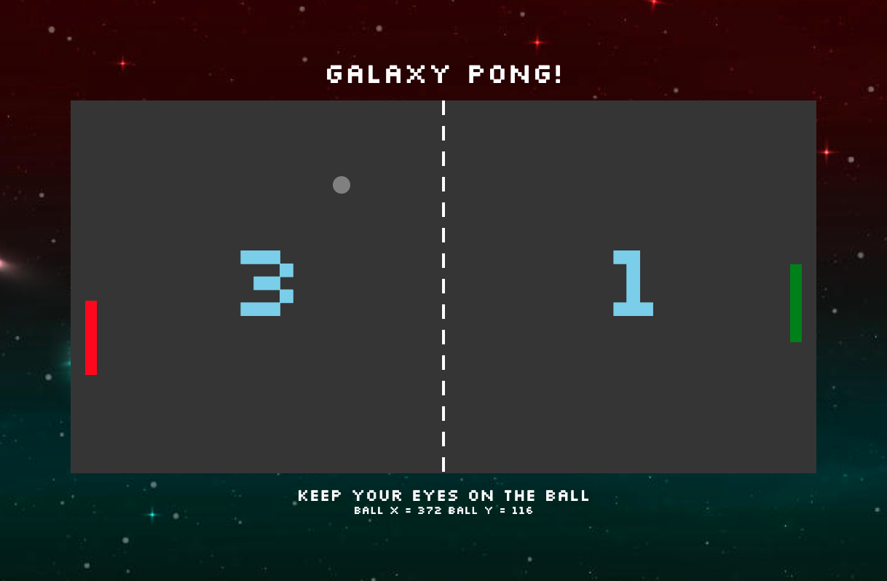
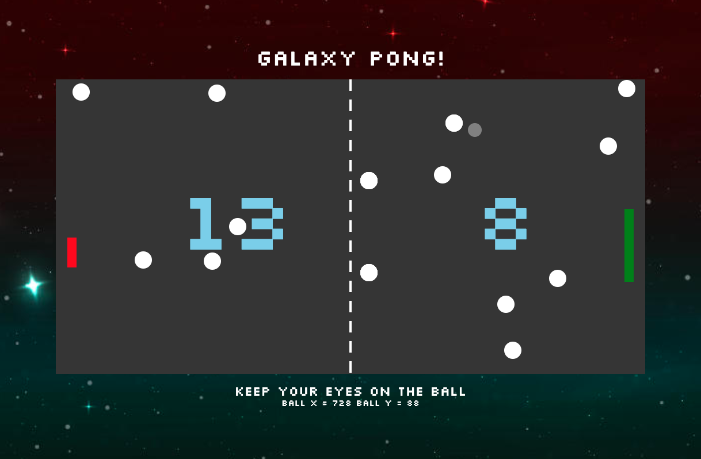
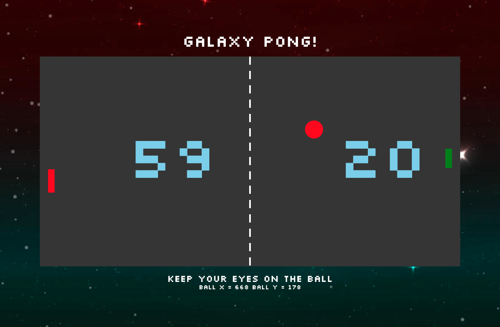

# Galaxy Pong Game 

Vintage ATARI Pong game using SVGs.

Follow the instructions bellow to play.

Use this link to play:
https://alefaissal.github.io/project2-pong/

## NEW Features of Galaxy Pong

* Deploy multi ball using "m'
* Finish multi ball using "n"
* Change type of ball and size of paddles using "c"
* Change ball and paddle back using "b"
* As player score, its paddles increase size and the opponent decrease size
* Game is over when some one reaches 10 points
* Space bar pause the game at any time

